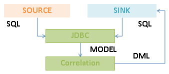

# TNPM Wireless Alarm Migration

## 

### Introduction

This repository consist Java program for the purpose of migrating TNPM Wireless Alarms.

### Environment

1. TNPM Wireless 1.4
2. Oracle Database

### Assumption

1. Migrate to a **Fresh/Empty** TNPM Wireless environment.
2. `ALARM_DOCUMENT_CONTEXT` is empty.
3. `ALARM_TEMPLATES` is empty.
4. `ALARM_DEFINITIONS` is empty.
5. `LC_ALARM_DEFINITIONS` is empty.

### High Level Approach
1. Perform `Technology Pack` and `Report Information` look up from `Source` to locate a match within `Sink` then update the `Alarm_Definition` and `Alarm_Templates` fields accordingly. 
2. 

### Overview Procedure

1. Import TNPM Wireless reports. **E.g.** `report_impexp -i -c all -u <PWEB_USER> -p <PWEB_PASSWORD> -f <REPORT_XML_FILE> -l <REPORT_FOLDER> -r true`
2. Migrate `ALARM_DOCUMENT_CONTEXT` table.
2. Migrate `ALARM_TEMPLATES` table.
3. Migrate `ALARM_DEFINITIONS` table.
4. #1 to #3 uses the Oracle `exp` utility. **E.g.** `exp <WIRELESS_USERNAME/<WIRELESS_PASSWORD>@<WIRELESS_ORACLE_SID> table=alarm_document_context,alarm_templates,alarm_definitions file=<A_FILE_NAME>` 
5. Validate `Alarm Templates` and `Alarm Definitions`from PWEB Alarm Manager.
6. Launch Eclipse with Source Code loaded.
7. Run Java program **WITHOUT** JDBC Connection commit (Validate from Eclipse Console that entries are updated accordingly).
8. Run Java program **WITH** JDBC Connection commit to finalize migration procedure. 

### Source Code Structure

1. `com.psl.wireless.alarm` - Entry point / Controllers
2. `com.psl.wireless.sql` - SQL library / templates
3. `com.psl.wireless.technologypack` - Models
4. Main method is `com.psl.wireless.alarm.UpdateAlarms`
5. `Source` and `Sink` database information in `com.psl.wireless.alarm.BootStrap`

### Future Work (Feature)
1. Delta migration. E.g. Migrate new Alarms from Staging to Production.
2. Single point invocation. E.g. `java -cp <LIST_OF_JARS> com.psl.some.class <STAGING_IP> <STAGING_SID> ... <PROD_IP> <PROD_SID> ...`.

### Future Work (Code Resiliency)
1. Use `java.util.logging` instead of standard out print.
2. Use `java.sql.PreparedStatement` instead of `String` to construct SQL.
3. Error recovery type logging. E.g. What to do upon reaching an error.
